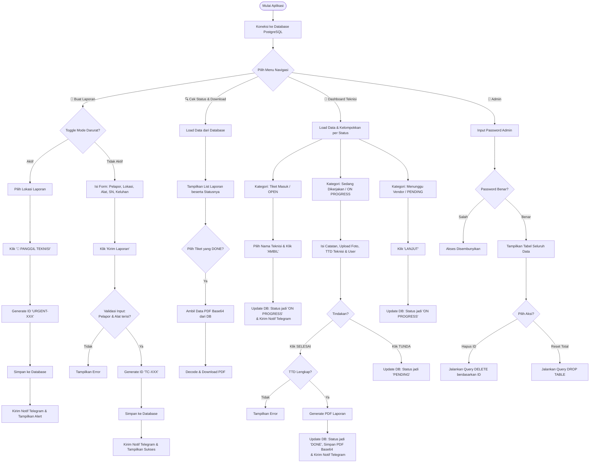

```mermaid
graph TD
    A([Mulai Aplikasi]) --> B[Koneksi ke Database PostgreSQL]
    B --> C{Pilih Menu Navigasi}

    %% ==========================================
    %% MENU 1: BUAT LAPORAN
    %% ==========================================
    C -->|📝 Buat Laporan| D{Toggle Mode Darurat?}
    
    %% Alur Darurat
    D -->|Aktif| E[Pilih Lokasi Laporan]
    E --> F[Klik '🚨 PANGGIL TEKNISI']
    F --> G[Generate ID 'URGENT-XXX']
    G --> H[Simpan ke Database]
    H --> I[Kirim Notif Telegram & Tampilkan Alert]
    
    %% Alur Normal
    D -->|Tidak Aktif| J[Isi Form: Pelapor, Lokasi, Alat, SN, Keluhan]
    J --> K[Klik 'Kirim Laporan']
    K --> L{Validasi Input: <br>Pelapor & Alat terisi?}
    L -->|Tidak| M[Tampilkan Error]
    L -->|Ya| N[Generate ID 'TC-XXX']
    N --> O[Simpan ke Database]
    O --> P[Kirim Notif Telegram & Tampilkan Sukses]

    %% ==========================================
    %% MENU 2: STATUS & DOWNLOAD
    %% ==========================================
    C -->|🔍 Cek Status & Download| Q[Load Data dari Database]
    Q --> R[Tampilkan List Laporan beserta Statusnya]
    R --> S{Pilih Tiket yang DONE?}
    S -->|Ya| T[Ambil Data PDF Base64 dari DB]
    T --> U[Decode & Download PDF]

    %% ==========================================
    %% MENU 3: TEKNISI
    %% ==========================================
    C -->|🔧 Dashboard Teknisi| V[Load Data & Kelompokkan per Status]
    
    %% OPEN
    V --> W[Kategori: Tiket Masuk / OPEN]
    W --> X[Pilih Nama Teknisi & Klik 'AMBIL']
    X --> Y[Update DB: Status jadi 'ON PROGRESS' <br> & Kirim Notif Telegram]
    
    %% ON PROGRESS
    V --> Z[Kategori: Sedang Dikerjakan / ON PROGRESS]
    Z --> AA[Isi Catatan, Upload Foto, TTD Teknisi & User]
    AA --> AB{Tindakan?}
    
    AB -->|Klik SELESAI| AC{TTD Lengkap?}
    AC -->|Tidak| AD[Tampilkan Error]
    AC -->|Ya| AE[Generate PDF Laporan]
    AE --> AF[Update DB: Status jadi 'DONE', Simpan PDF Base64 <br> & Kirim Notif Telegram]
    
    AB -->|Klik TUNDA| AG[Update DB: Status jadi 'PENDING']
    
    %% PENDING
    V --> AH[Kategori: Menunggu Vendor / PENDING]
    AH --> AI[Klik 'LANJUT']
    AI --> AJ[Update DB: Status jadi 'ON PROGRESS']

    %% ==========================================
    %% MENU 4: ADMIN
    %% ==========================================
    C -->|🔐 Admin| AK[Input Password Admin]
    AK --> AL{Password Benar?}
    AL -->|Salah| AM[Akses Disembunyikan]
    AL -->|Benar| AN[Tampilkan Tabel Seluruh Data]
    AN --> AO{Pilih Aksi?}
    AO -->|Hapus ID| AP[Jalankan Query DELETE berdasarkan ID]
    AO -->|Reset Total| AQ[Jalankan Query DROP TABLE]
```
